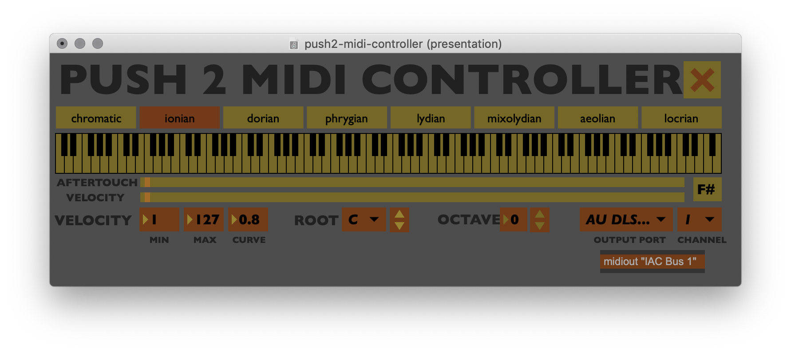

# Push 2 MIDI Controller
## Use Ableton Push 2 with any software or hardware that supports USB MIDI

## About

This patch *receives* raw MIDI from the "Ableton Push 2 Live Port" **input**, processes it, and sends out MIDI notes to an output of your choice. The output can be a USB MIDI device, or a 'virtual' channel that can be used as an input with another piece of software like a DAW.

## Setup

With a DAW or other piece of software:

- Disable the "Ableton Push 2 Live Port" and "Ableton Push 2 User Port" MIDI inputs and outputs in your softwares settings
- Enable input from the "from Max 1" MIDI input
- Make sure that "from Max 1" is selected (it should be default) in the patch

With a hardware synth or other USB MIDI device:
- Make sure your device is plugged in *before* you open the patch
- Select the hardware device and MIDI channel in the dropdown in the bottom right of the patch
- Make sure the device is set to receive on the same MIDI chanel that's selected in the patch
